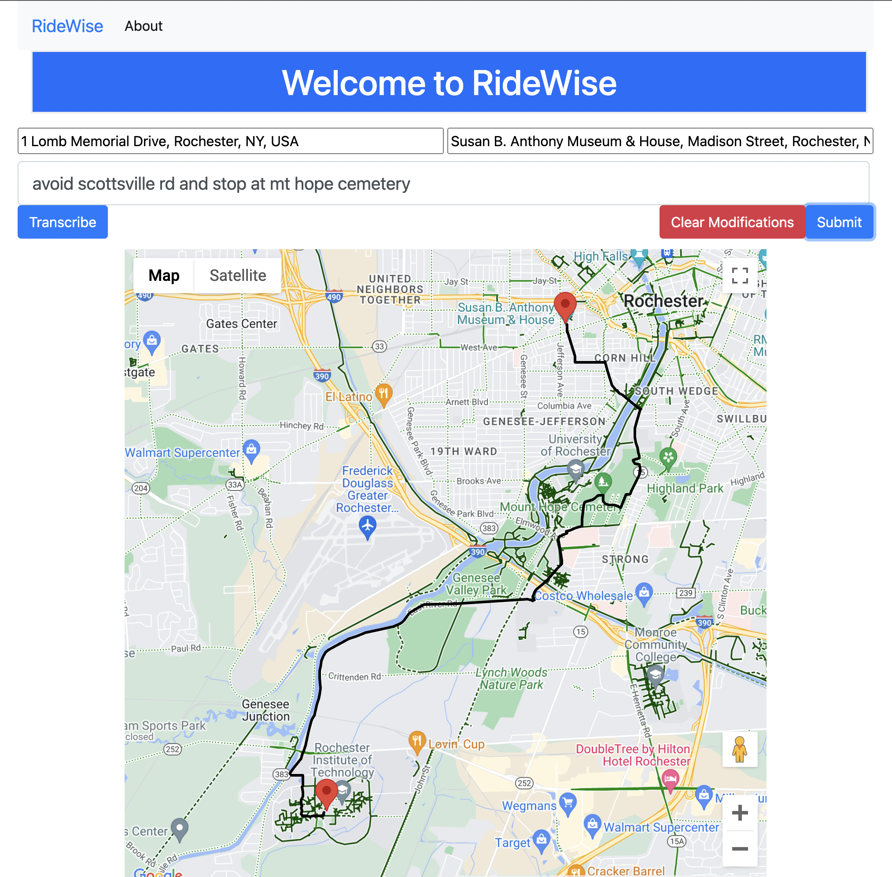
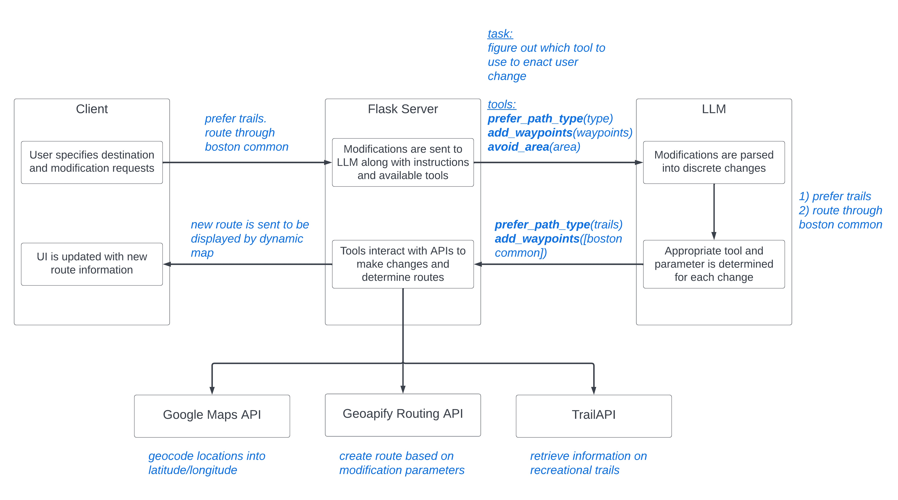

# RideWise

Modern navigation apps are extremely effective for cars, but are missing the adaptability necessary for bicycling. In this work, I have attempted to address these shortcomings by incorporating a Large Language Model (LLM) into the standard navigation app structure. This element allows users to request custom modifications in a free-form and easy-to-use format.

# Architecture

# Poster

[Poster](documents/capstone_poster.pdf)

# Paper

[Paper](documents/capstone_final_report.pdf)

# Usage

1. Install requirements as listed in [requirements.txt](requirements.txt)

2. Follow instructions to download and quantize Llama 2 model: https://python.langchain.com/docs/integrations/llms/llamacpp. Store model(s) in folder outside project: `llama2/llama/{model_files}`

3. Run `app.py` and navigate to http://localhost:5001 (or whatever port you specify)
